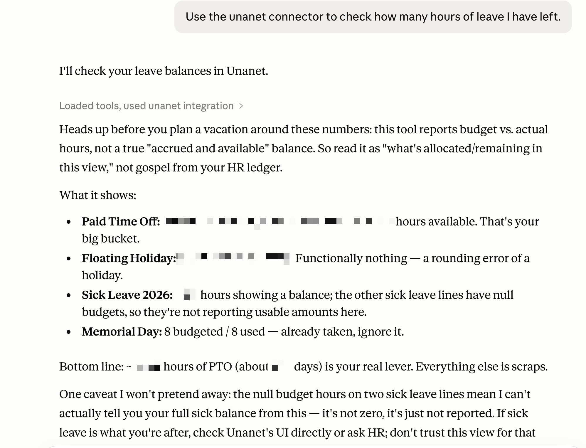

# Unanet MCP Server for Claude Desktop

This fork lets Claude Desktop talk to Nava's Unanet GovCon instance through the Model Context Protocol (MCP). It has been substantially updated from the original API-key design to use Unanet Platform REST: username/password login, short-lived bearer tokens, and safe-by-default tool registration.

The happy path is macOS + Claude Desktop.

## What works today

By default, the server exposes one safe read-only tool:

- `unanet_get_my_leave_balances` — reads your Unanet leave balances with minimized output.

Example in Claude Desktop:



With explicit opt-in, the server can also expose additional Platform REST read tools:

- `unanet_get_projects`
- `unanet_get_project_details`
- `unanet_get_project_status`
- `unanet_get_timesheets`
- `unanet_get_my_timesheet_projects`
- `unanet_get_company_info`
- `unanet_get_billing_status`
- `unanet_get_financial_report`

Write-capable tools are gated behind a separate flag. Some are intentionally disabled or require confirmation until their Platform REST write flow is safe enough for routine use.

## Quick install for Mac users

### 1. Install Node.js

Install Node.js **20 or newer** from:

```text
https://nodejs.org/
```

Choose the current LTS installer for macOS.

### 2. Download or clone this repo

If you use Git:

```bash
git clone https://github.com/navapbc/unanet-mcp-server.git
cd unanet-mcp-server
```

If you downloaded a ZIP, unzip it and open Terminal in the project folder.

### 3. Run the Mac setup script

```bash
./setup-mac.sh
```

The script will:

1. Check Node.js/npm.
2. Install dependencies.
3. Build the server.
4. Create a local `.env` file if needed.
5. Add this MCP server to Claude Desktop's config.

Your password stays in the local `.env` file. It is not written into Claude Desktop's config.

### 4. Restart Claude Desktop

Fully quit and reopen Claude Desktop.

Then ask Claude:

```text
Show my Unanet leave balances.
```

If Claude can use the tool, the install worked.

## Manual Mac install

Use this if you prefer to see each step.

### 1. Build the server

```bash
cd /Users/YOU/path/to/unanet-mcp-server
npm install
npm run build
```

### 2. Create `.env`

```bash
cp .env.example .env
```

Edit `.env`:

```env
UNANET_BASE_URL=https://navapbc.unanet.biz
UNANET_USERNAME=your-username
UNANET_PASSWORD=your-password
UNANET_APP_NAME=NavaUnanetMCP

# Safe default: only the leave-balance tool is exposed.
UNANET_ENABLE_LEGACY_READ_TOOLS=false
UNANET_ENABLE_WRITE_TOOLS=false
```

To expose additional read tools:

```env
UNANET_ENABLE_LEGACY_READ_TOOLS=true
```

To expose write-capable tools:

```env
UNANET_ENABLE_WRITE_TOOLS=true
```

Only enable write tools when you intentionally want Claude to see them. Timesheet writes require `confirm: true`; several other legacy write tools still fail closed until they have safe Platform REST implementations.

### 3. Add the server to Claude Desktop

Edit:

```text
~/Library/Application Support/Claude/claude_desktop_config.json
```

Add or merge this entry:

```json
{
  "mcpServers": {
    "unanet": {
      "command": "/bin/bash",
      "args": [
        "-lc",
        "cd /absolute/path/to/unanet-mcp-server && node dist/index.js"
      ]
    }
  }
}
```

Why use `bash -lc`? The server loads `.env` from the project directory, so Claude needs to start it from that folder.

Restart Claude Desktop after changing the config.

## Environment variables

| Variable | Required | Default | Purpose |
| --- | --- | --- | --- |
| `UNANET_BASE_URL` | Yes | `https://navapbc.unanet.biz` | Unanet tenant origin. Do not include `/platform/rest`. |
| `UNANET_USERNAME` | Yes | — | Your Unanet username. |
| `UNANET_PASSWORD` | Yes | — | Your Unanet password. |
| `UNANET_APP_NAME` | No | `NavaUnanetMCP` | Value sent in the `X-Una-App` header. |
| `UNANET_ENABLE_LEGACY_READ_TOOLS` | No | `false` | Enables additional read tools/resources. Name is historical. These now use Platform REST bearer auth. |
| `UNANET_ENABLE_WRITE_TOOLS` | No | `false` | Enables mutating tools. Use carefully. |
| `UNANET_ALLOWED_BASE_URLS` | No | Nava tenant only | Comma-separated allow-list for additional production origins. |
| `UNANET_ALLOW_INSECURE_LOCAL_MOCK` | No | `false` | Allows `http://localhost` / `127.0.0.1` for local mock testing only. |
| `LOG_LEVEL` | No | `info` | Reserved for logging behavior. |

Legacy `UNANET_API_KEY` and `UNANET_FIRM_CODE` are no longer needed for the Platform REST tools in this fork.

## Tool surface

### Default safe tool

| Tool | Description |
| --- | --- |
| `unanet_get_my_leave_balances` | Read your leave balances for a date range. |

### Additional read tools

Requires:

```env
UNANET_ENABLE_LEGACY_READ_TOOLS=true
```

| Tool | Description |
| --- | --- |
| `unanet_get_projects` | Search projects with optional filters. |
| `unanet_get_project_details` | Retrieve a project by key/id. |
| `unanet_get_project_status` | Retrieve project status-style summary data. |
| `unanet_get_timesheets` | Search your timesheets by date range, including entry-level timeslip summaries. |
| `unanet_get_my_timesheet_projects` | List projects available to charge on your timesheet for a given date. |
| `unanet_get_company_info` | Retrieve organization/company details. |
| `unanet_get_billing_status` | Retrieve billing-adjacent project invoice setup/account data. |
| `unanet_get_financial_report` | Limited invoice-search-backed financial reporting. |

### Write-capable tools

Requires:

```env
UNANET_ENABLE_WRITE_TOOLS=true
```

| Tool | Current behavior |
| --- | --- |
| `unanet_submit_timesheet` | Live write; adds confirmed timeslip rows to an existing timesheet and requires `confirm: true`. |
| `unanet_submit_expense` | Disabled/fail-closed until expense allocation keys are modeled. |
| `unanet_update_project_budget` | Disabled/fail-closed; Platform REST requires a full project update payload. |
| `unanet_update_lead` | Disabled/fail-closed; no Platform REST lead endpoint identified. |
| `unanet_create_opportunity` | Disabled/fail-closed; no Platform REST opportunity endpoint identified. |
| `unanet_generate_invoice` | Disabled/fail-closed; no generic generate endpoint identified. |
| `unanet_approve_timesheet` | Live write; requires `confirm: true`. |
| `unanet_create_contact` | Live write; requires `confirm: true` and an organization id. |

## Architecture notes for maintainers

This fork uses two clients in `src/auth.ts`:

- `createPlatformRestClient` — raw Platform REST client used for login and the leave tool.
- `createUnanetClient` — Platform REST client that auto-prefixes `/platform/rest`, fetches/caches a bearer token, and adds `Authorization: Bearer <token>`.

Authentication flow:

```text
POST /platform/rest/login
→ cache token in memory
→ call /platform/rest/... with Authorization: Bearer <token>
```

Security choices:

- `.env` is ignored.
- `.env.test` is no longer tracked.
- Production base URLs must be HTTPS and allow-listed.
- Local insecure mock URLs require explicit opt-in.
- Tokens are cached in memory only.
- Default Claude tool surface is read-only.

## Development

```bash
npm install
npm run build
npm test
npm run mock-server
```

Project layout:

```text
src/
├── index.ts              # MCP server entry point
├── auth.ts               # Platform REST auth, base URL validation, token cache
├── mock-server.ts        # Local mock Unanet API for tests
├── tools/
│   ├── leave.ts          # Default safe read-only leave-balance tool
│   ├── projects.ts       # Project tools
│   ├── timesheet.ts      # Timesheet/expense tools
│   ├── contacts.ts       # Organization/contact tools
│   └── financials.ts     # Billing/financial tools
├── resources/
│   └── reports.ts        # Optional MCP resources
└── types/
    └── unanet.ts         # Shared types
```

## Troubleshooting

### Claude does not show the Unanet tools

1. Fully quit and reopen Claude Desktop.
2. Confirm the server builds:

   ```bash
   npm run build
   ```

3. Confirm the Claude config points at the right folder:

   ```text
   ~/Library/Application Support/Claude/claude_desktop_config.json
   ```

4. Confirm `.env` exists in the project folder.

### Authentication errors

Check:

- `UNANET_BASE_URL=https://navapbc.unanet.biz`
- `UNANET_USERNAME` is set
- `UNANET_PASSWORD` is set
- You can log into Unanet normally with the same credentials

### Base URL rejected

The server intentionally rejects arbitrary production hosts. If you need another Unanet tenant, add it explicitly:

```env
UNANET_ALLOWED_BASE_URLS=https://other-tenant.unanet.biz
```

## Windows

This fork is primarily used on macOS at Nava. A Windows helper script still exists:

```text
setup-windows.bat
```

It is best-effort and less exercised than the Mac setup path.

## License

MIT License. See `LICENSE` for details.
